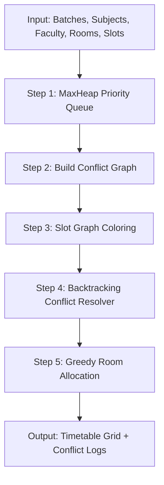

# University ERP — Technical Specification

## 1. Core Architecture Overview

| Layer | Technology |
| :--- | :--- |
| **Frontend** | React 18, TypeScript, Vite, Tailwind CSS |
| **State Management** | Redux Toolkit + RTK Query |
| **Backend** | Node.js 20, Express.js, TypeScript |
| **Database** | MongoDB 7 + Mongoose ODM |
| **Authentication** | JWT (Access Token in memory + Refresh Token in HttpOnly cookie) |
| **PDF Generation** | Puppeteer with Handlebars HTML templates |
| **DSA Engine** | MaxHeap Priority Queue, Conflict Graph Coloring, Backtracking, Greedy Room Allocation |
| **Containerization** | Docker, Docker Compose, Nginx reverse proxy |
| **DevOps & Hosting** | GitHub Actions CI/CD pipeline, Docker Hub, AWS EC2 (Ubuntu 22.04) |

---

## 2. Core Modules Specification

### A. Timetable Scheduling (DSA Engine)



1. **MaxHeap Priority Queue**: Ranks subjects using priority weight based on credit count, weekly required hours, and lab vs theory status.
2. **Conflict Graph**: Constructs an adjacency list graph where nodes represent subject-batch-faculty units and edges represent shared faculty or batch conflicts.
3. **Graph Coloring**: Iteratively assigns time slots (colors) ensuring adjacent nodes never share the same time slot.
4. **Backtracking**: When slot coloring hits a constraint deadlock, backtracks up to a configured maximum depth cap (e.g. depth 50) to find valid alternate slots.
5. **Greedy Room Allocation**: Matches assigned sessions with valid room types (Theory room vs Specialized Lab room) selecting the smallest valid room capacity ≥ batch student size.

### B. Attendance Marker System

1. **Session Attendance Submission**:
   - Accepts batch, subject, timeSlot, date, academicYear, and array of student records (`present`, `absent`, `late`).
   - Duplicate Guard: Returns `409 Conflict` if attendance for the exact slot, subject, batch, and date is already submitted.
2. **Attendance Percentage Computation**:
   - Calculates total conducted sessions vs attended sessions per subject and overall.
   - Dynamic threshold check (`< 75%`) flags student as a defaulter.
3. **Reporting & PDF Engine**:
   - HOD dashboard renders interactive attendance matrix, subject filters, and defaulter list.
   - Puppeteer generates print-ready PDF reports (`attendanceReport.hbs`).

---

## 3. DevOps & AWS EC2 Deployment Architecture

### Docker Container Structure

```
+-------------------------------------------------------------------+
|                            AWS EC2                                |
|                                                                   |
|   +-----------------------------------------------------------+   |
|   |                   Nginx Container (Port 80)               |   |
|   +-----------------------------+-----------------------------+   |
|                                 |                                 |
|                 +---------------+---------------+                 |
|                 |                               |                 |
|                 v                               v                 |
|   +---------------------------+   +---------------------------+   |
|   | Client Container (Nginx)  |   | Server Container (Node)   |   |
|   | Serving React SPA         |   | Express API (Port 5000)   |   |
|   +---------------------------+   +-------------+-------------+   |
|                                                 |                 |
|                                                 v                 |
|                                   +---------------------------+   |
|                                   | MongoDB 7 Container       |   |
|                                   | Persistent Volume         |   |
|                                   +---------------------------+   |
+-------------------------------------------------------------------+
```

### GitHub Actions CI/CD Pipeline Flow

1. **`test-and-lint`**:
   - Checks Node.js 20 environment.
   - Executes server and client linting (`npm run lint`), TypeScript checks (`npm run type-check`), and server Jest tests (`npm test`).
2. **`build-and-push`**:
   - Builds Docker images for `server` and `client` using multi-stage Dockerfiles.
   - Pushes tagged images to Docker Hub registry.
3. **`deploy`**:
   - Establishes SSH connection to AWS EC2.
   - Executes `docker-compose -f docker-compose.prod.yml pull && docker-compose -f docker-compose.prod.yml up -d`.
   - Performs automated HTTP health check (`/api/v1/health`).
